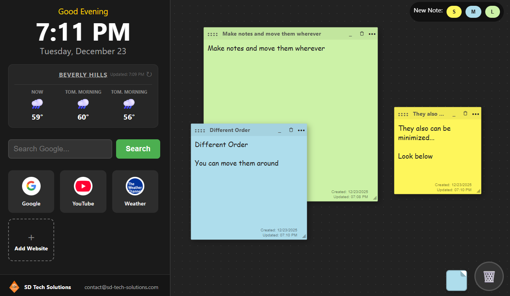

# SD Tech Solutions - Personal Start Page

A private, high-contrast browser start page designed for seniors and anyone seeking a calm, clutter-free computing experience.

## 📋 At a Glance

**What is this?**
This is a "New Tab" page that lives entirely on your computer. It replaces the confusing clutter of modern browsers with a simple, organized dashboard containing your favorite links, a weather forecast, and digital sticky notes.

**Why was it built?**
To provide a **"Cognitive Accessibility"** focused experience. It prioritizes legibility, large click targets, and forgiveness (easy undo/recovery), making the web less intimidating for senior users.

**Top 3 Features:**

- **🔒 100% Private:** No accounts, no logins, no cloud. Your data never leaves your browser.
- **👁️ Easy to See:** High-contrast "Dark Mode" with large, clear typography reduces eye strain.
- **🧠 "Sticky" Memory:** It automatically remembers your notes and links, so they are always there when you open the internet.

---

## 🚀 Setup Guide

1.  **Download:** Get the `index.html` file from this repository.
2.  **Open:** Double-click the file to open it in your browser (Chrome, Edge, Firefox, Safari).
3.  **Set as Homepage:** Go to your browser settings and set this file as your "On Startup" page. Now, your personal dashboard will load every time you open the internet.

---

## 📖 Detailed Information

### 🛠️ Feature Breakdown

**1. Productivity Dashboard (Speed Dial)**

- **One-Click Access:** Large, distinct cards for favorite websites.
- **Smart Icons:** Automatically fetches high-quality logos for any link added.
- **Live Search:** Integrated Google search bar with extra-large text input.

**2. Interactive Sticky Notes**

- **Drag & Drop:** Move notes anywhere on the screen to organize your thoughts.
- **The Dock:** "Minimize" notes to a side dock to keep the workspace clean without losing information. Hovering over a docked note gives a quick text preview.
- **Timestamps:** Automatically tracks when a note was created and last updated.
- **Safety Net:** A two-stage "Trash Can" deletion system prevents accidental data loss.

**3. Weather Forecasting**

- **Zero-Config:** Simply enter a Zip Code. No complex setup or API keys required.
- **Smart Forecast:** Displays current temp, plus +6h and +12h forecasts.
- **Natural Language:** Uses relative terms like "Tonight" or "Tomorrow Morning" rather than abstract times, making it easier to plan your day.

### 🔒 Security & Privacy Architecture

This application follows a strict **"Local-First"** security philosophy.

- **Client-Side Only:** This is a static HTML file. There is no backend database and no server tracking your activity.
- **Browser Local Storage:** All configuration data (links, notes, zip code) is saved securely inside your specific web browser's `localStorage` sandbox.
  - _Security Benefit:_ Your personal notes and browsing habits are physically incapable of being sent to SD Tech Solutions or any third party because the code to do so simply does not exist.
- **External Requests:** The only time the page connects to the internet is to fetch anonymous public data:
  - _Google Favicons:_ To display website logos.
  - _Open-Meteo & Zippopotam.us:_ To fetch weather data based on a Zip Code (no personal identifiers are sent).

---

**[SD Tech Solutions](https://sd-tech-solutions.com)** _Simple, Secure IT Solutions San Diego_
